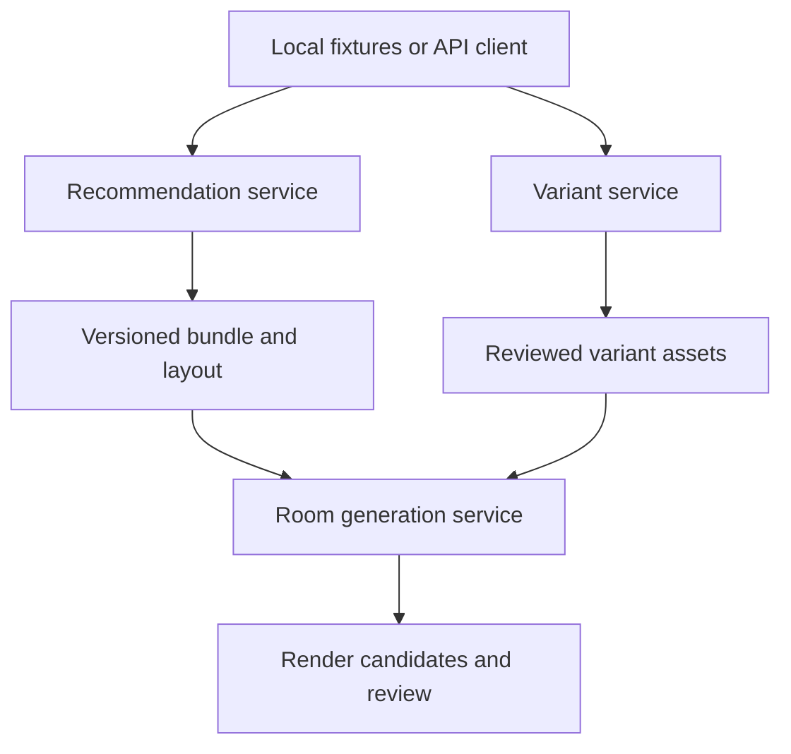

# System architecture

## Problem and proposed solution

Three standalone capabilities must share stable meanings for products, variants, design profiles and results. Separating selection from image generation prevents a renderer from becoming the authority on prices, product eligibility or fit. It does not guarantee visual identity; that remains a measured acceptance condition.

Use three independently runnable Python projects under a future `ai_services/` parent. Each has its own package, dependency lock, tests and local state. Recommendation is CPU-oriented; the image projects expose lightweight APIs and separate inference workers. An API and its worker are two processes belonging to one service, not two independent business services.

Arrows represent data dependencies. A local test client passes exported contract documents and uploads assets; none of the services must synchronously call another to prove its own capability. No consumer imports another project's Python internals or reads its database.

## Ownership

| Boundary | Owns | Does not own |
|---|---|---|
| Recommendation | Imported catalogue snapshot, feature index, brief validation, eligibility, ranking, bundle and basic layout | Generated image pixels, customer accounts |
| Variant generator | Source image copies, masks, generated visual assets, review records | Supplier prices or creation of purchasable SKUs |
| Room generator | Room inputs, reference copies, rendering jobs, visual validation and review | Selecting replacement products or approving physical feasibility |
| Shared contracts | Versioned wire definitions, fixtures, error vocabulary | Shared mutable tables or business logic |

Keep catalogue ingestion inside recommendation initially. A future catalogue authority may be extracted when multiple writers or supplier integrations require it. Variant exports are proposed visual assets: catalogue acceptance is a separate explicit operation. Review approval and commercial availability must remain distinct.

## Local execution modes

1. Notebook: directly call candidate pipelines, save inputs/results and evaluate.
2. Package: extract pure transformations and application use cases into each project's `src/` package; notebooks import them.
3. HTTP: route requests to those same use cases. Recommendation can return immediately; images use durable jobs.
4. Worker: claim persisted jobs, run model inference and commit candidate metadata. Run one worker per image service initially, with hardware capacity checked before concurrent model residency.

Implementation phases must preserve this order. An agent may scaffold packages and fake adapters before model evidence exists, but it must not implement a model-backed production path or UI-facing claim until the matching notebook/evaluation gate has passed. The current Node/React application becomes a consumer of these HTTP contracts, not a shared codebase or shared database for AI service internals.

## Extensibility

Define ports for assets, repositories, job execution, clock, identity context and model inference. Local adapters use filesystem assets and SQLite. Future adapters can use remote storage, different databases or queue infrastructure without rewriting domain logic. SQLite is a local baseline, not a promised multi-node job broker.

Use immutable input snapshots per job. Save product references locally through an import endpoint before submitting a render. Cross-service imports preserve upstream IDs and content hashes while assigning a service-local asset ID. Do not expose local paths as portable API identifiers.

## Runtime boundaries

Default HTTP listeners bind to loopback only. A local development identity may be explicitly enabled and must fail closed outside local mode. Authorization, TLS termination and deployment identity are future integration decisions; interfaces must already carry owner context. Model inference must not run inside the API event loop. Startup checks validate configuration and model availability; health does not download weights.

## Suite integration boundary

The local suite is an orchestration convenience, not a fourth business service. It starts recommendation, variants, room generation and any test client with explicit environment variables and independent databases. Cross-service traffic uses public HTTP endpoints and exported fixtures only. No service imports another service's Python modules, opens another service's SQLite database, or reads another service's local asset paths.

The existing UI integrates through an adapter layer that maps current quiz, catalogue, render and upload records into versioned AI-service contracts. During migration the UI may retain its legacy render path behind a feature flag, but any new standalone-service result must be traceable by service ID, schema version, bundle/render/variant revision and source asset hash.
