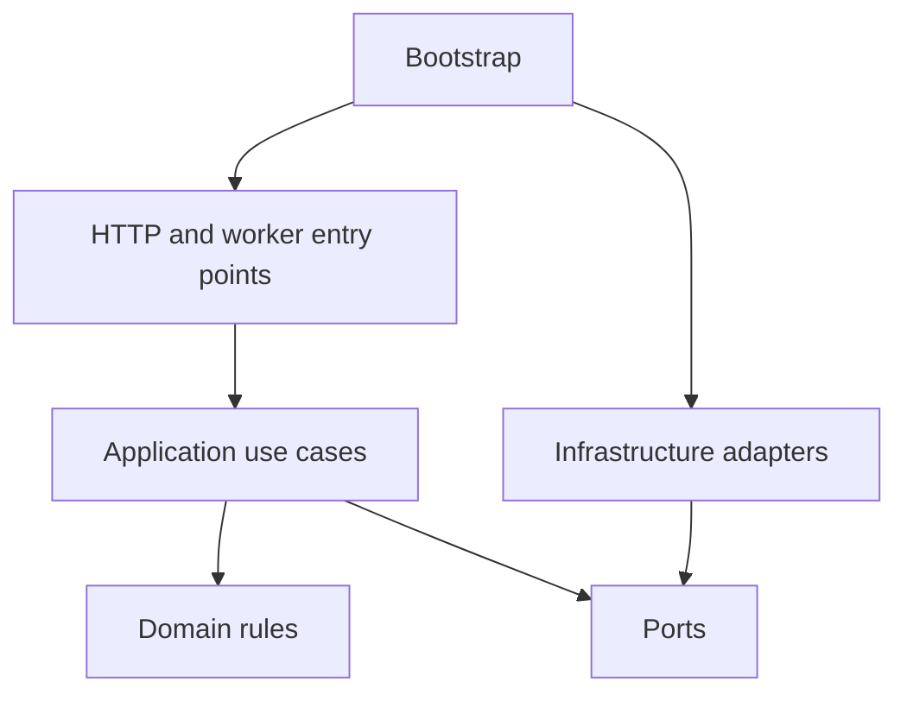

# Clean architecture and testing standards

## Dependency direction

Domain contains pure types and invariants. Application orchestrates use cases through ports. Adapters implement ports using databases, files or models. API/worker entry points translate external requests and invoke application code. Bootstrap is the only composition root that wires concrete implementations.

API schema validation and domain validation serve different purposes. The API checks payload shape; the domain enforces valid decisions regardless of whether a caller is HTTP, a notebook or a test. Use framework-neutral domain types and explicit DTO conversion. Do not put business rules in route handlers or embed SQL/model inference in entity methods.

## Required coding conventions

Use a `src/` package layout, type hints, small named use cases and explicit constructor injection. Separate pure transformations from I/O. Prefer functions for stateless transforms; classes are useful for stateful adapters and use-case dependencies. Avoid speculative base classes and generic service/repository hierarchies.

Use typed exceptions for invalid input, no feasible result, missing asset, model unavailable and retryable infrastructure failure. Catch them at entry-point/worker boundaries; unexpected exceptions produce a sanitized external failure and a correlated diagnostic record. No blanket swallowing of exceptions or printing secrets. Operational structured logging is required even though notebook output should remain focused.

Model load belongs to adapter lifecycle, never module import or every request. Inference uses the library's inference mode and explicit device/precision. Avoid hidden global state. Persist preprocessing/configuration with the model so notebook and service inference apply identical transforms.

## Test matrix

| Type | Runs locally | Uses real weights | Purpose |
|---|---|---|---|
| Unit | Every change | No | Domain rules, application branching, mask math, totals |
| Contract | Every change | No | HTTP/JSON meaning, IDs, errors, versions |
| Adapter integration | Before merge | Usually no | Real temporary filesystem/SQLite, transaction behaviour |
| Model smoke | On model/config change | Yes | Loads pinned runtime and produces a valid candidate |
| Model evaluation | Before promotion | Yes | Held-out quality and comparative evidence |
| End-to-end | Before stage acceptance | Selected real pipeline | Proves exported/imported fixtures flow between services |

Unit tests must not require GPU, Internet, cloud accounts, catalogue downloads or real customer data. Fake model ports return tiny deterministic images/vectors; test decisions around outputs without asserting diffusion behaviour from mocks. Use temporary directories/databases and injected clocks. Test retries with clock control, not real sleeps.

## Meaningful test cases

Recommendation: exact limit prices; dimensions in inches/mm; missing commercial status; insufficient inventory; stable ties; invalid substitutions; no-result explanations. Variants: inverted masks; feather bands; image orientation; alpha; empty masks; wrong parent; pending/rejected status. Rooms: missing assets; wrong quantities; invalid instance IDs; protected areas; stale snapshots; candidate rejection. Jobs: worker dies after claim; lease expires; stale worker completes; same idempotency key with different body; cancellation racing completion; asset write succeeds but DB commit fails.

Contract tests must use a real in-process HTTP client with fake application dependencies and validate the shared fixtures. Integration tests exercise real local repositories. Both are needed; mocking a repository does not test a transaction.

## Quality gates for the later implementation

Proposed tooling: pytest, pytest-cov, Ruff and mypy, plus API framework schema validation. Verify compatible versions and lock them per project. Require lint, formatting, type checks, unit/contract/integration tests and zero unresolved critical security defects before release review. Propose >=85% branch coverage on domain/application packages, plus explicit coverage of every hard constraint and failure transition. Coverage is a floor; mirrored implementation tests do not prove behaviour.

Separate slow `gpu` and `evaluation` test groups. Fast CI excludes them; promotion requires their recorded results. Public exposure additionally requires authentication/authorization tests, rate limits, upload limits, retention/deletion policy and a deployment-specific security review. Those are future release gates, not silently completed by local tests.

## Agent task completion rules

Every implementation task assigned to an agent must name its service, phase, contract fixtures, allowed files, expected local commands and done criteria. An agent cannot mark a task complete unless:

- fast tests for the touched service pass locally;
- relevant contract fixtures are added or updated;
- fake adapters cover success and failure paths when real models are unavailable;
- README or runbook commands remain accurate;
- no service boundary is crossed by importing internals or sharing databases;
- known limitations are written in the appropriate experiment report, ADR or guide.

For cross-service work, `make test-all` or the suite equivalent must pass in addition to service-local tests. For UI-adapter work, include adapter fixture tests that prove current app records map to service contracts and back to persisted service IDs/revisions.

## Notebook extraction procedure

Freeze a successful notebook run. Identify inputs/outputs and pure transformations. Move those functions into the owning package with characterization tests from approved cases. Replace notebook implementations with package imports. Re-run the fixed fixtures and compare rankings/constraints exactly, numeric transforms within documented tolerances, and generative quality statistically/review-wise. Then wrap the same use case in HTTP. Avoid maintaining separate notebook and server implementations.

Sources: [pytest integration practices](https://docs.pytest.org/en/stable/explanation/goodpractices.html). Tool choices beyond source facts are proposed engineering decisions.
